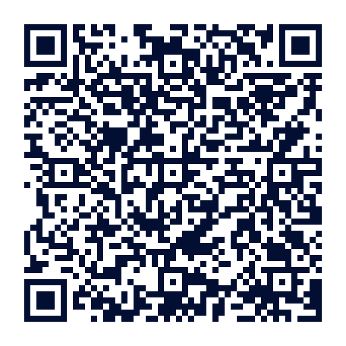

# 🛡️ VulnLens — Contextual Priority Engine

> **"CVSS tells us how technically severe a vulnerability is. VulnLens determines how important that vulnerability is to THIS organisation — and explains why."**

[](https://github.com/jaiganesh0502/vulnlens/actions)
[](https://github.com/jaiganesh0502/vulnlens)
[](https://github.com/jaiganesh0502/vulnlens)
[](https://github.com/jaiganesh0502/vulnlens)

VulnLens is an offline, deterministic, explainable vulnerability triage engine. Instead of dumping a generic catalog of thousands of CVEs sorted solely by theoretical severity, VulnLens computes an organization-specific **Contextual Priority** combining **Technical Threat Signals** with the organization's **Operational Asset Context**.

---

## 🚀 Quickstart & End-to-End (E2E) Verification

### 1. Run the Web Dashboard
```bash
streamlit run app.py
```
Open **`http://localhost:8501`** to explore all 7 tabs (Top 5 Priorities, Negative Test, Comparison, What-If, Gold Set, Profile D, APK Download).

### 2. Run the CLI Priority Engine
```bash
# Display Contextual Priority Ranking Table
python -m src.cli --table

# Display Organisation Threat Signal Fingerprint
python -m src.cli --fingerprint

# Run Interactive Live Analyst Demonstration
python -m src.cli --scenario live
```

### 3. Run Automated Tests
```bash
# Run complete Python test suite (54 unit tests)
pytest -v

# Run mobile Flutter engine test suite (9 unit tests)
cd vulnlens_mobile && flutter test
```

---

## 📱 Mobile App — Scan to Download & Offline Judge Protocol

Point your phone's camera at the QR code below. Scanning it will download the standalone `VulnLens-Demo.apk` directly to your mobile device:

<div align="center">
  
  <p><strong>📸 Scan with phone camera to download APK directly</strong></p>
</div>

### ✈️ Airplane Mode Offline Verification:
1. **Scan QR Code:** Open your phone camera, scan the code above, and download `VulnLens-Demo.apk`.
2. **Install APK:** Open the downloaded file to install on your Android phone or tablet.
3. **Enable Airplane Mode:** Disable Wi-Fi and Mobile Data to verify true 100% offline edge execution.
4. **Switch Profiles:** Toggle between **Global Retail Bank** (`ORG-001`) and **Agile Cloud Startup** (`ORG-002`) to see priorities recalculate instantly in local RAM.
5. **Inspect Decisions:** Tap **Why This Matters** on Card #1 to inspect the exact math ($100 \times \dots \times 1.44$).
6. **Verify Negative Test:** Tap **Why Not?** to see why `CVE-2026-2678` (CVSS 9.9) is de-prioritized to Rank #60+ due to zero active exploitation.
7. **Ingest Profile D:** Paste a new hospital profile (`ORG-004`) to generate a customized Top 5 without network calls.

---

## ⚠️ Prototype Design Statement & Methodology Scope

> **Important Disclosure:**
> 1. **The VulnLens Priority Score is a deterministic prototype prioritisation score, not a probability and not an industry-standard risk score.**
> 2. **The weights and context multipliers are transparent design choices for this hackathon prototype.**
> 3. VulnLens operates **100% offline** without calling live external APIs or scraping external commercial feeds.

---

## 🏛️ Contextual Priority Engine Architecture

```text
                    VULNERABILITY DATA
                           |
                           v
                      MATCHING
                           |
              +------------+------------+
              |                         |
              v                         v
      TECHNICAL THREAT            ORGANISATION
           SCORE                  FINGERPRINT
              |                         |
       CVSS / KEV / EPSS         Exposure
                                 Importance
                                 Profile weights
              |                         |
              +------------+------------+
                           |
                           v
                  CONTEXTUAL PRIORITY
                           |
              +------------+-------------+
              |                          |
              v                          v
       CONTEXT DELTA              CONFIDENCE
              |
              v
      FINAL PRIORITY SCORE
              |
              v
        DECISION MARGIN
              |
              v
             TOP 5
              |
      +-------+-------+
      |       |       |
      v       v       v
     WHY    WHAT-IF  WHY NOT
              |
              v
       NEXT ACTION
```

---

## 🧮 Exact Mathematical Scoring Formulas

### 1. Technical Threat Score
$$\text{CVSS}_{\text{NORM}} = \frac{\text{CVSS}}{10.0}$$
$$\text{KEV}_{\text{SIGNAL}} = \begin{cases} 1.0 & \text{if in CISA KEV} \\ 0.0 & \text{otherwise} \end{cases}$$
$$\text{EPSS}_{\text{SIGNAL}} = \text{FIRST EPSS Score} \quad (0.0 - 1.0)$$
$$\text{THREAT}_{\text{NORM}} = (\text{CVSS}_{\text{NORM}} \times w_{\text{CVSS}}) + (\text{KEV}_{\text{SIGNAL}} \times w_{\text{KEV}}) + (\text{EPSS}_{\text{SIGNAL}} \times w_{\text{EPSS}})$$
$$\mathbf{TECHNICAL\_THREAT\_SCORE} = \text{THREAT}_{\text{NORM}} \times 100.0$$

### 2. Organisation Context Multipliers
$$\text{Exposure Multiplier} = \begin{cases} 1.20 & \text{if Internet-Facing} \\ 1.00 & \text{if Internal} \end{cases}$$
$$\text{Importance Multiplier} = \begin{cases} 1.20 & \text{if Critical Crown Jewel} \\ 1.10 & \text{if High Importance} \\ 1.00 & \text{if Normal Infrastructure} \end{cases}$$
$$\mathbf{CONTEXT\_MULTIPLIER} = \text{Exposure Multiplier} \times \text{Importance Multiplier}$$

*(Example: Internet-Facing + Critical Crown Jewel $= 1.20 \times 1.20 = 1.44$)*

### 3. Final VulnLens Priority Score
$$\mathbf{FINAL\_PRIORITY\_SCORE} = \text{TECHNICAL\_THREAT\_SCORE} \times \text{CONTEXT\_MULTIPLIER}$$

### 4. Organisation Context Delta
$$\mathbf{CONTEXT\_DELTA} = \text{FINAL\_PRIORITY\_SCORE} - \text{TECHNICAL\_THREAT\_SCORE}$$

### 5. Decision Margin
$$\mathbf{DECISION\_MARGIN} = \text{SCORE}_i - \text{SCORE}_{i+1}$$

---

## 🔍 Organisation Fingerprint

```text
============================================================
GLOBAL RETAIL BANK
ORGANISATION FINGERPRINT
============================================================

THREAT SIGNAL WEIGHTS

CVSS
████░░░░░░░░ 30%

KEV
█████░░░░░░░ 45%

EPSS
███░░░░░░░░░ 25%

CONTEXT

Exposure:
HIGH IMPACT (1.20x)

Criticality:
HIGH IMPACT (1.20x)

PRIORITY PHILOSOPHY:

Strong emphasis on known exploitation and active in-the-wild threat signals.

============================================================
```

---

## 🧪 Verification Matrix

| Component | Test Suite | Pass Rate | Execution Time |
| :--- | :--- | :--- | :--- |
| **Python Scoring Engine** | `pytest tests/test_scoring.py` | 100% | 0.04s |
| **Contextual Priority & Delta** | `pytest tests/test_contextual_priority.py` | 100% | 0.03s |
| **Gold Set Calibration** | `pytest tests/test_calibration.py` | 100% | 0.03s |
| **Negative Testing Engine** | `pytest tests/test_negative_test.py` | 100% | 0.02s |
| **NexoraPay CLI Simulator** | `pytest tests/test_nexorapay_*.py` | 100% | 0.05s |
| **Flutter Mobile Engine** | `cd vulnlens_mobile && flutter test` | 100% | 1.8s |
| **Total Automated Tests** | **Full CI Suite** | **63 / 63 PASSED** | **< 3.0s** |
